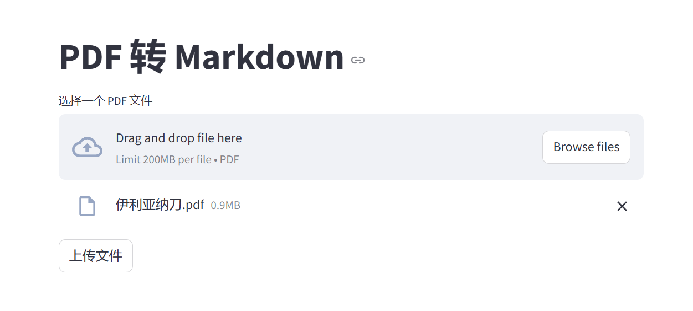

# Markify

Convert files into markdown to help RAG or LLM understand, based on markitdown and MinerU, which could provide high quality pdf parser.
In current, it support simple pdf model(use pdfminer, it is fast) and advanced pdf model (use mineru with models to parse pdf, it is slow).


## API
FastAPI自带API文档 http://127.0.0.1:20926/docs
### 上传文件，创建任务
请求
```shell
curl -X 'POST' \
  'http://127.0.0.1:20926/api/jobs' \
  -H 'accept: application/json' \
  -H 'Content-Type: multipart/form-data' \
  -F 'file=@CoA.pdf;type=application/pdf' \
  -F 'pdf_mode=advanced'
```
响应
```json
{
  "job_id": "29bbad6b-c167-41f0-8a29-99551c499263"
}
```
### 查询任务状态
请求
```shell
curl -X 'GET' \
  'http://127.0.0.1:20926/api/jobs/29bbad6b-c167-41f0-8a29-99551c499263' \
  -H 'accept: application/json'
```
响应
```json
{
  "job_id": "29bbad6b-c167-41f0-8a29-99551c499263",
  "status": "completed",
  "filename": "CoA.pdf",
  "params": {
    "pdf_mode": "advanced"
  },
  "error": null
}
```
### 下载markdown文件
请求
```shell
curl -X 'GET' \
  'http://127.0.0.1:20926/api/jobs/29bbad6b-c167-41f0-8a29-99551c499263/result' \
  -H 'accept: application/json'
```
响应
文件


## Docker部署
```shell
docker pull wsjcuhk/markify:0.0.1
docker run -d -p 20926:20926 wsjcuhk/markify:0.0.1
```

## 基于streamlit的web界面

```shell
streamlit run ./client/streamlit_client.py
```


## TODO
- 优化Mineru中输出的图像地址为本机地址
- 添加云端解析模式
